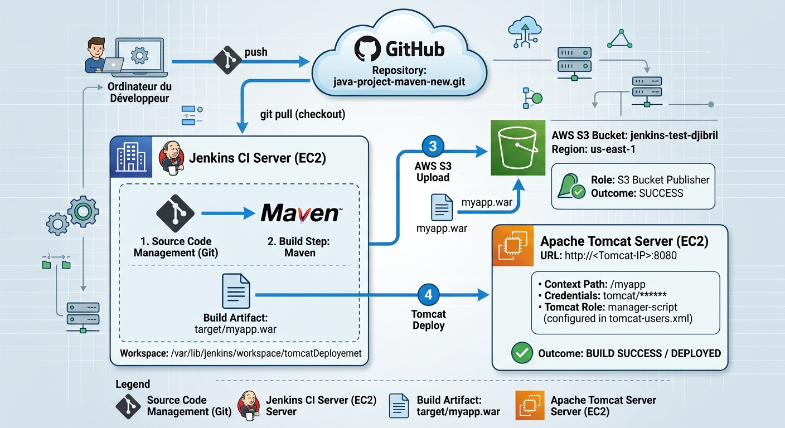
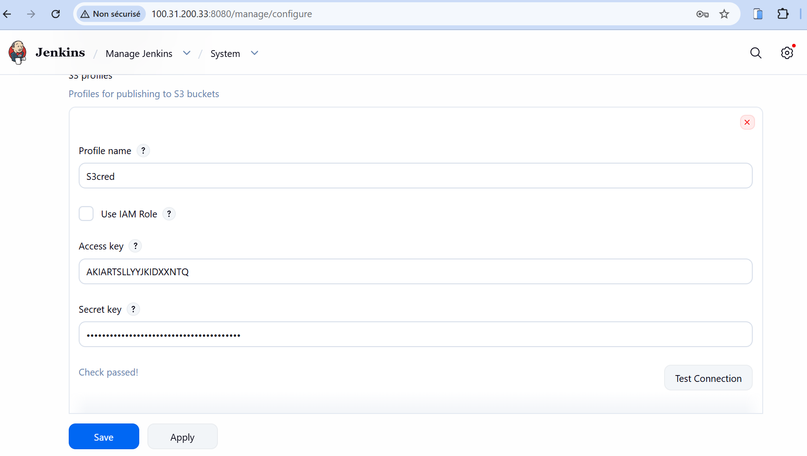
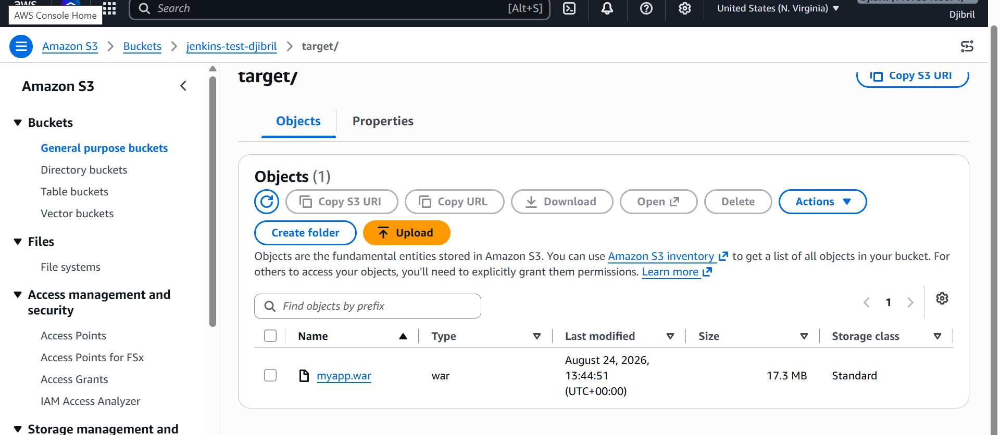
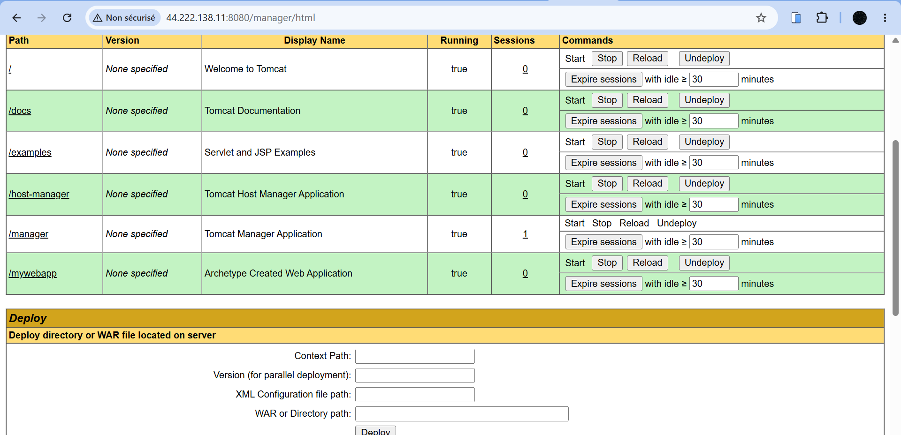
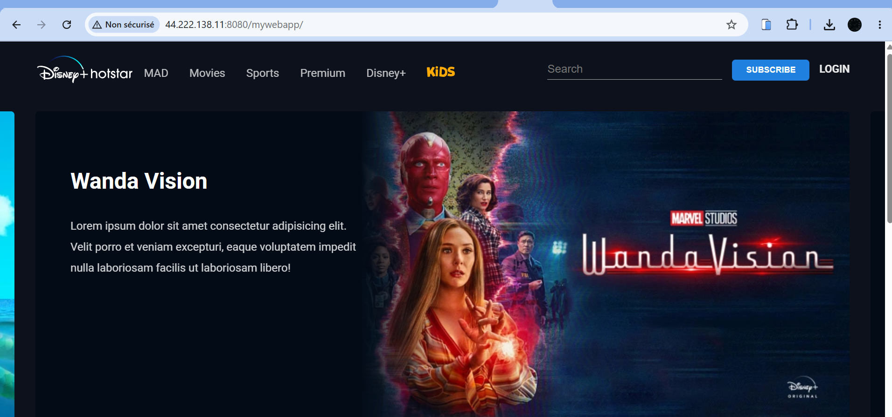

# Automated CI/CD Pipeline for Java Web Application with Jenkins, AWS S3 & Tomcat

Ce projet met en place un pipeline d'intégration et de déploiement continus (CI/CD) automatisé. Lorsqu'un développeur pousse du code Java vers GitHub, Jenkins récupère les sources, compile l'application avec **Apache Maven**, stocke l'artefact généré (`myapp.war`) dans un bucket **AWS S3** pour archivage, et le déploie automatiquement sur un serveur web **Apache Tomcat**.

---

## 📐 Architecture du Projet



### Workflow CI/CD :
1. **Push Code :** Le développeur pousse le code source de l'application Java vers le dépôt GitHub (`java-project-maven-new.git`).
2. **Build (Jenkins & Maven) :** Le serveur Jenkins CI (hébergé sur EC2) détecte les changements, extrait le code, et exécute Maven pour builder le fichier Web Application Archive (`myapp.war`).
3. **Archivage (AWS S3) :** Jenkins téléverse l'artefact d'application (`myapp.war`) dans un bucket S3 (`jenkins-test-djibril` - région `us-east-1`) pour sauvegarde et versionnement.
4. **Déploiement (Apache Tomcat) :** Jenkins déploie automatiquement le fichier WAR sur le serveur Apache Tomcat (hébergé sur une instance EC2 distincte).

---

## 🛠️ Tech Stack & Outils

* **Source Control Management :** Git & GitHub
* **Serveur CI/CD :** Jenkins (sur instance AWS EC2)
* **Outil de Build :** Apache Maven
* **Stockage d'artefacts :** AWS S3 (`jenkins-test-djibril`)
* **Serveur d'application :** Apache Tomcat (sur instance AWS EC2)
* **OS :** Linux / AWS EC2

---

## 📁 Structure du Dépôt

```text
jenkins-tomcat-deployment-first-project/
├── Architecture.jpg           # Schéma explicatif de l'architecture CI/CD
├── Screenshots/               # Preuves de déploiement et configurations
│   ├── Build-Job-On-Jenkins.png
│   ├── Final-Resule.png
│   ├── Mywebapp-on-tomcat.png
│   ├── Store_Artefact-on-S3.png
│   ├── test-connection-jenkins-s3.png
│   └── tomcat-credential-created-on-jenkins.png
├── pom.xml                    # Fichier de configuration Maven
└── src/                       # Code source de l'application Java Web
```

---

## ⚙️ Configuration & Étapes de Mettre en Œuvre

### 1. Configuration des Identifiants (Credentials) sur Jenkins
* **AWS Credentials :** Ajouter la clé d'accès et la clé secrète AWS IAM bénéficiant des rôles d'écriture sur le bucket S3 `jenkins-test-djibril`.
* **Tomcat Credentials :** Configurer un identifiant de type `Username with password` correspondant à un utilisateur Tomcat ayant le rôle `manager-script` (défini dans `tomcat-users.xml`).


### 2. Validation de la Connexion AWS S3
Tester la connectivité entre Jenkins et AWS S3 via les plugins dédiés dans Jenkins.



### 3. Exécution du Pipeline de Build
Le job Jenkins `tomcatDeployemet` est exécuté :
1. Extraction du code GitHub.
2. Compilation et packaging via Maven (`mvn clean package`).
3. Génération de l'artefact `./target/myapp.war`.


### 4. Stockage sur AWS S3
L'artefact compilé est envoyé sur le bucket AWS S3 spécifié.



### 5. Déploiement et Résultat Final
L'application est déployée sur le serveur Apache Tomcat sous le chemin `/myapp`.

* **Manager Tomcat :**



* **Application finale en ligne :**



---

## 🚀 Utilisation

1. Cloner le dépôt :
   ```bash
   git clone https://github.com/votre-nom/java-project-maven-new.git
   ```
2. Compiler localement avec Maven :
   ```bash
   mvn clean package
   ```
3. Accéder à l'application déployée via navigateur :
   ```text
   http://<TOMCAT_PUBLIC_IP>:8080/myapp
   ```